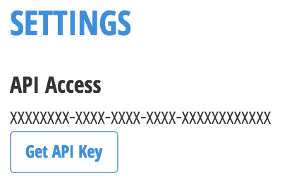

[](LICENSE)

# ansible-role-cloudhealth

## Requirements

This module requires `httplib2` to be installed on the host machine. It can be
installed via `apt-get` (`sudo apt-get install python-httplib2`) or via `pip`
(`sudo pip install httplib2`) if not available in the distribution package
manager.

## Role Variables

### `cloudhealth_api_key`



The `cloudhealth_api_key` is used to identify yourself to our API. This
variable is **required**.

Your API key can be found in the *Settings* section of
[your profile](https://apps.cloudhealthtech.com/profile). If it appears to be
empty, click on *Get API Key* to get one.

Define it in your playbooks like this:

```yaml
cloudhealth_api_key: xxxxxxxx-xxxx-xxxx-xxxx-xxxxxxxxxxxx
```

You can avoid to store your API key in your playbooks by setting it like this:

```yaml
cloudhealth_api_key: "{{ lookup('env','CLOUDHEALTH_API_KEY') }}"
```

Then, in your `~/.bashrc` file, add the following line and don't forget to
`source ~/.bashrc` or open a new terminal:

```bash
export CLOUDHEALTH_API_KEY=xxxxxxxx-xxxx-xxxx-xxxx-xxxxxxxxxxxx
```

Another option is to use
[Ansible Vault](http://docs.ansible.com/ansible/playbooks_vault.html) to store
the API key.

## Development environment

Start by setting your API key in an environment variable called
`CLOUDHEALTH_API_KEY`.

Then install [Vagrant](https://www.vagrantup.com/) and
[VirtualBox](https://www.virtualbox.org/) using your favorite package manager
and run:

```bash
vagrant up
```

This will spin up a minimal virtual machine and provision it with a test
playbook using that role.

If that step succeeds, syntax of the role is correct and all tasks are
successful on a bare machine.

To provision the virtual machine again, run the following:

```bash
vagrant up # Unnecessary if the VM is already running
vagrant provision
```

Once you are done with changes, you can run one of the following:

```bash
vagrant halt -f # Shuts down the VM for later re-use
vagrant destroy -f # Destroys the VM entirely
```
