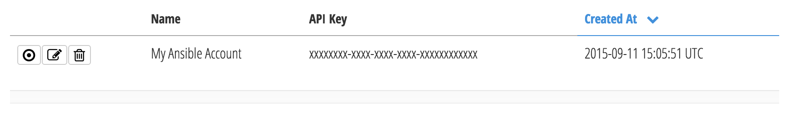

[](LICENSE)

# CloudHealth Collector

This role allows CloudHealth's customers to integrate our platform into their
Ansible setup.

## Requirements

Make sure that you have not [turned off fact
gathering](https://docs.ansible.com/ansible/playbooks_variables.html#turning-off-facts)
in your playbooks. `gather_facts: no` must not be present in your playbooks.

This module requires `httplib2` to be installed on the host machine. It can be
installed via `apt-get` (`sudo apt-get install python-httplib2`) or via `pip`
(`sudo pip install httplib2`) if not available in the distribution package
manager.

Additionally, there is a current limitation regarding the `uptime` of your
nodes: you need to either use Ansible 2+, or to have `ohai` or `facter`
installed on your managed nodes. Failing to do so will leave your nodes'
`uptime` information blank on the CloudHealth platform.

## Role Variables

### `cloudhealth_api_key`

The `cloudhealth_api_key` is used to identify yourself to our API. This
variable is **required**.

Go to the [Ansible Accounts](https://apps.cloudhealthtech.com/ansible_accounts)
page. If there is no accounts listed yet, create one by clicking on [*New
Account*](https://apps.cloudhealthtech.com/ansible_accounts/new).

Your API key will then be listed next to your account name on that [Ansible
Accounts](https://apps.cloudhealthtech.com/ansible_accounts)
page:



You then need to define it in your playbooks.

The most straightforward way to do so is to store it in plain text in your
playbook variables:

```yaml
cloudhealth_api_key: xxxxxxxx-xxxx-xxxx-xxxx-xxxxxxxxxxxx
```

However, to avoid storing your API key in your playbooks, first set the following in your playbook variables:

```yaml
cloudhealth_api_key: "{{ lookup('env','CLOUDHEALTH_API_KEY') }}"
```

Then, either add the following line in your `~/.bashrc` file (don't forget to
`source ~/.bashrc` or to open a new terminal) or run this command before
executing your playbooks:

```bash
export CLOUDHEALTH_API_KEY=xxxxxxxx-xxxx-xxxx-xxxx-xxxxxxxxxxxx
```

Finally, a third option, more secure, is to use
[Ansible Vault](http://docs.ansible.com/ansible/playbooks_vault.html) to store
the API key.

## Development environment

Start by setting your API key in an environment variable called
`CLOUDHEALTH_API_KEY`.

Then install [Vagrant](https://www.vagrantup.com/) and
[VirtualBox](https://www.virtualbox.org/) using your favorite package manager
and run:

```bash
vagrant up
```

This will spin up a minimal virtual machine and provision it with a test
playbook using that role.

If that step succeeds, syntax of the role is correct and all tasks are
successful on a bare machine.

To provision the virtual machine again, run the following:

```bash
vagrant up # Unnecessary if the VM is already running
vagrant provision
```

To run an ad-hocs command on that machine, for example to retrieve all facts
from it, run the following:

```bash
ansible all -i .vagrant/provisioners/ansible/inventory/vagrant_ansible_inventory -u vagrant --private-key .vagrant/machines/default/virtualbox/private_key -m setup
```

Once you are done with changes, you can run one of the following:

```bash
vagrant halt -f # Shuts down the VM for later re-use
vagrant destroy -f # Destroys the VM entirely
```
